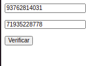

# Desafio Backend

## Requirements
- Python 3.8
- Flask 
- Docker

## 1 - Clone repo:
    $ git clone https://github.com/uandisson/desafio_backend.git
     
## 2 - Build : (optional) 
    $ cd app/
    $ docker-compose build
     
## 3 - Start and debug:
    $ cd app/
    $ docker-compose up

## 4 - If all is well, in the browser: http://127.0.0.1:5000/



## 5 - MongoDB config
    $ docker exec -it desafio_backend_mongo bash
    $ mongo -u admin -p
    $ mongodb> use desafiodb
    $ mongodb> db.createUser({user: 'admin', pwd: 'admin', roles: [{role: 'readWrite', db: 'desafiodb'}]})
    $ mongodb> exit
    $ mongo -u admin -p your admin --authenticationDatabase desafiodb
    $ mongodb> exit
    $ exit

## 6 - On the first run (only), uncomment this excerpt in the app.py file to import the json from the /app/data/ folder

    import json

    collection_clientes = db['clientes']
    collection_taxas = db['taxas']

    with open('data/clientes.json') as f:
        file_data = json.load(f)

    collection_clientes.insert_many(file_data)

    with open('data/taxas.json') as f:
        file_data = json.load(f)

    collection_taxas.insert_many(file_data)


## Structure

Endpoint |HTTP Method | CRUD Method | Result
-- | -- |-- |--
`login` | POST | READ | Login customer
`loan`| POST | READ | Get Tax Customer
`simulation`| POST | READ | Get Amount, Tax and Fees Customer

## Use

Check customer:
```
	curl -i -H "Content-Type: application/json" -X POST -d '{"cpf": "93762814031", "phone_number": "71935228778"}' http://127.0.0.1:5000/login

```
get:
```
    {
        "message": "Ok, find custumer", 
        "status": true
    }

```

do simulation:
```
    curl -i -H "Content-Type: application/json" -X POST -d '{"loan_value": "1000.0", "tax": "0.45", "installments": "6"}' http://127.0.0.1:5000/simulation
```
get:
```
    {
        "message": "Loan value: R$ 1000.00\nFees (Tax: 0.45): R$ 27.31\nAmount after (6 months): R$ 1027.31", 
        "status": true
    }

```

in the browswer:


