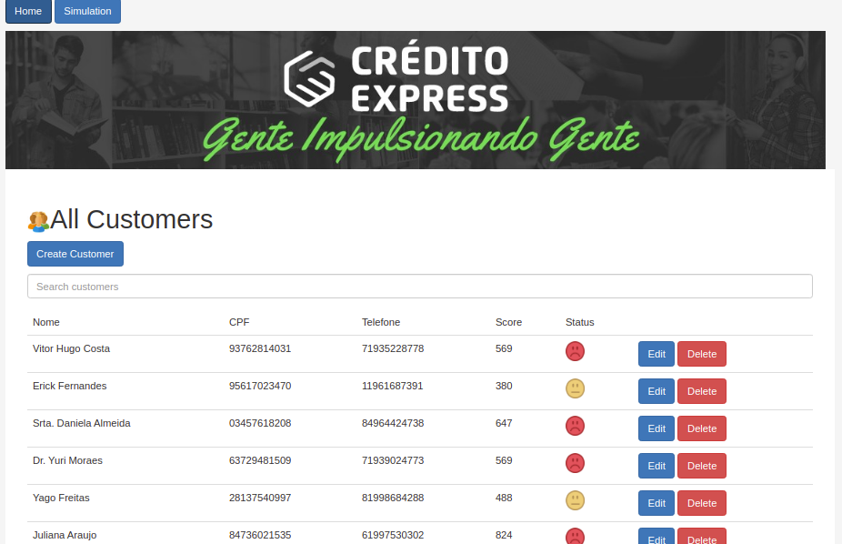
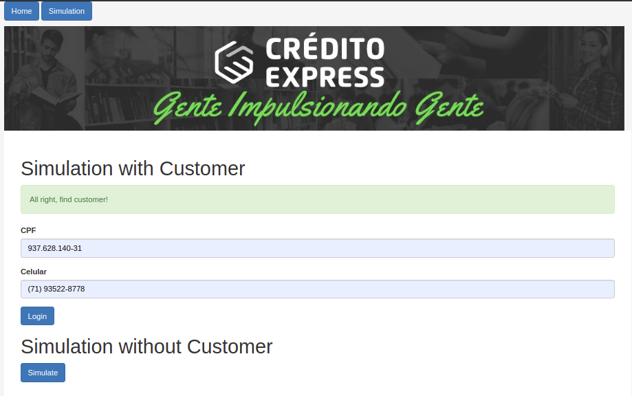
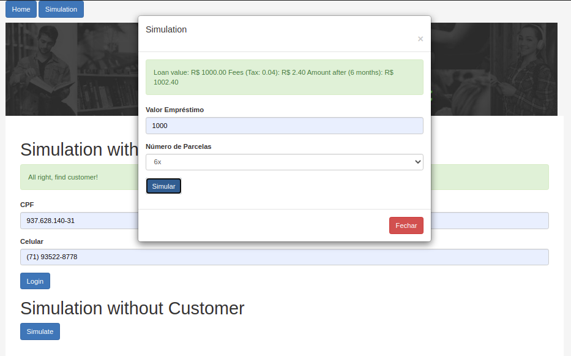

# Frontend-Vue

## Requisitos

- Node 14
- Vue JS
- Docker (opcional) -> recomendado

## Executar sem Docker

Instalar dependências
    
    $ npm install

Executar

    $ npm run dev
    
## Executar com Docker

Iniciar e Debugar

    $ cd frontend-vue/
    $ sudo docker-compose up

## URL -> : http://127.0.0.1:8080

Tela inicial

Simulação

# Deploy: Amazon EC2 (temporáriamente)

O Amazon Elastic Compute Cloud (Amazon EC2) é um serviço Web que disponibiliza capacidade computacional segura e redimensionável na nuvem. Ele foi projetado para facilitar a computação em nuvem na escala da web para os desenvolvedores. A interface de serviço Web simples do Amazon EC2 permite que você obtenha e configure a capacidade sem muito esforço. Oferece um controle completo de seus recursos computacionais e permite que você trabalhe no ambiente computacional comprovado da Amazon.

## Backend -> : http://3.128.30.149:5000 ou http://ec2-3-128-30-149.us-east-2.compute.amazonaws.com:5000

## Frontend -> : http://3.128.30.149:8080